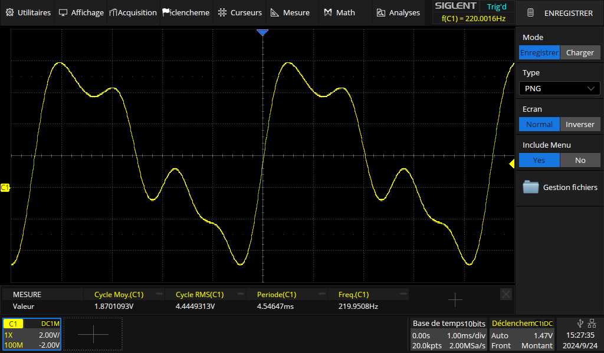
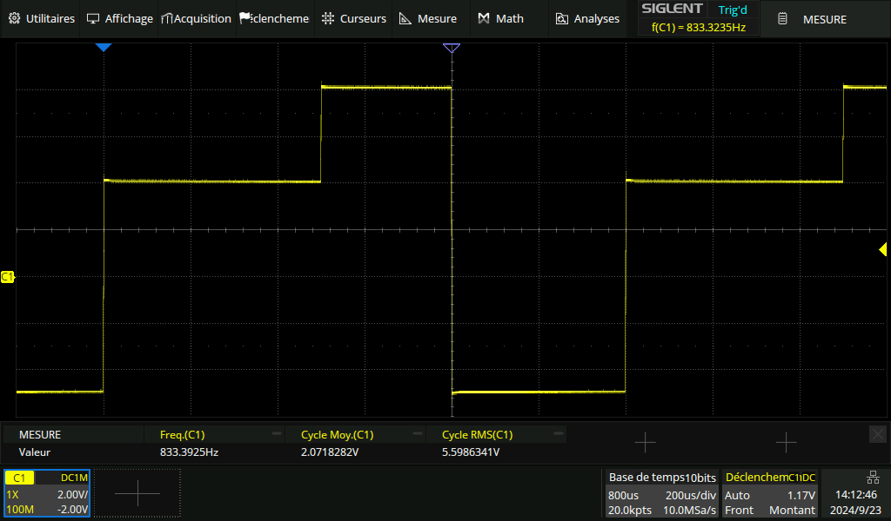

# Représentation temporelle d’un signal

!!! quote "Repère pour la formation – Partie physique - Option B"

    - Savoir identifier le type de signal (périodique ou non et/ou aléatoire) grâce à son chronogramme.
    - Savoir déterminer les caractéristiques d’un signal périodique (période, fréquence, valeur moyenne, valeur efficace, valeur maximale, valeur crête à crête).
    - *Savoir régler un générateur pour produire un signal périodique dont les caractéristiques sont données.*

## Cours

[Représentation temporelle d’un signal - Cours :material-file-pdf-box:](../../assets/cours/representation-temporelle-signaux/bts-ciel_representation-temporelle-signaux_cours.pdf)

## Exercices

[Représentation temporelle d’un signal - Exercices :fontawesome-solid-file-pdf:](../../assets/cours/representation-temporelle-signaux/bts-ciel_representation-temporelle-signaux_exercices.pdf)

## TP - Valeurs moyenne et efficace

??? abstract "Résumé"

    - Mesures de période, de fréquence à l'oscilloscope numérique ;
    - Mesure de valeur moyenne et de valeur efficace à l'oscilloscope numérique et au voltmètre.

Énoncé : [TP - Valeurs moyenne et efficace d’un signal périodique :fontawesome-solid-file-pdf:](../../assets/cours/representation-temporelle-signaux/bts-ciel_representation-temporelle-signaux_TP1.pdf)

Fichier CSV pour GBF Siglent : [Archive ZIP :fontawesome-solid-file:](../../assets/cours/representation-temporelle-signaux/tp1_signal_CSV.zip)

{width="500"}
/// caption
///

## TP - Composante alternative

??? abstract "Résumé"
    
    - Mesures valeur maximale, valeur crête à crête, valeur moyenne et valeur efficace à l'oscilloscope ;
    - Couplage DC puis AC de l'oscilloscope ;
    - Composante alternative.

Énoncé : [TP - Composante alternative d’un signal périodique :fontawesome-solid-file-pdf:](../../assets/cours/representation-temporelle-signaux/bts-ciel_representation-temporelle-signaux_TP2.pdf)

Fichier CSV pour GBF Siglent : [Archive ZIP :fontawesome-solid-file:](../../assets/cours/representation-temporelle-signaux/tp2_signal_CSV.zip)

{width="500"}
/// caption
///