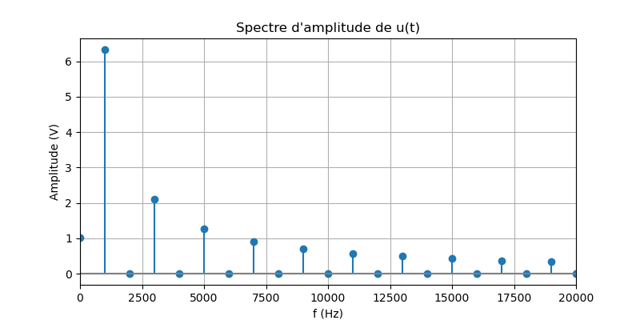
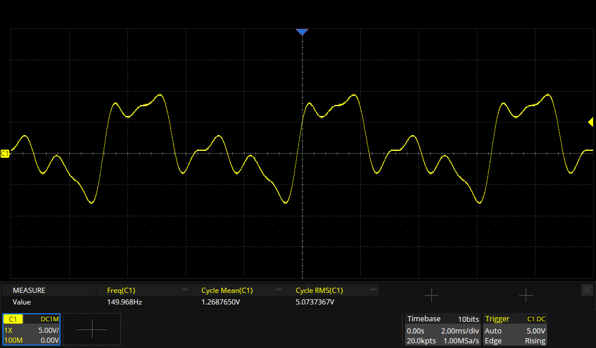
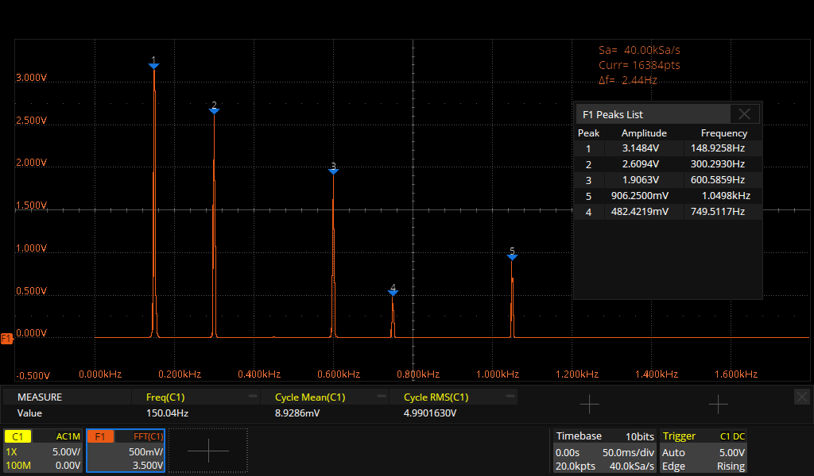

# Représentation fréquentielle d’un signal

!!! quote "Repère pour la formation – Partie physique - Option B"

    - Savoir utiliser la décomposition d’un signal périodique en une somme de sinusoïdes ; relation temps fréquence entre les deux représentations.
    - Savoir analyser un spectre de raies : identification du fondamental, de l’harmonique de rang n.
    - Savoir analyser le spectre d’un signal quelconque (encombrement spectral, présence de bruit, etc.).
    - Connaître les unités des signaux : dBm, dBV, dBµV et savoir convertir une grandeur exprimée en V en dBV et une grandeur en W en dBm (et inversement).
    - Savoir utiliser une échelle en dB (dBm, dBV ou dBµV) sur un spectre (mesure de l’amplitude de chaque raie) et avoir conscience de son utilité (visualiser les raies de faible amplitude).

## Cours

[Représentation fréquentielle d’un signal - Cours (PDF)](../../assets/cours/representation-frequentielle-signaux/bts-ciel_representation-frequentielle-signal_cours.pdf)

## Exercices

[Représentation fréquentielle d’un signal - Exercices (PDF)](../../assets/cours/representation-frequentielle-signaux/bts-ciel_representation-frequentielle-signal_exercices.pdf)

## TP - Décomposition harmonique

??? abstract "Décomposition harmonique d'un signal carré à partir de Python"

Énoncé : [TP1 - Décomposition spectrale d’un signal (PDF)](../../assets/cours/representation-frequentielle-signaux/bts-ciel_representation-frequentielle-signal_tp1.pdf)

{width="500"}
/// caption
///

{width="500"}
/// caption
///

## TP - Spectre d'un signal périodique

??? abstract "Spectre RMS d'un signal périodique quelconque à partir d'un oscilloscope numérique"

Énoncé : [TP2 - Spectre d’un signal périodique (PDF)](../../assets/cours/representation-frequentielle-signaux/bts-ciel_representation-frequentielle-signal_tp2.pdf)

Fichier CSV pour GBF Siglent : [Archive ZIP](../../assets/cours/representation-frequentielle-signaux/tp2_signal_periodique.zip)

{width="500"}
/// caption
///

{width="500"}
/// caption
///

