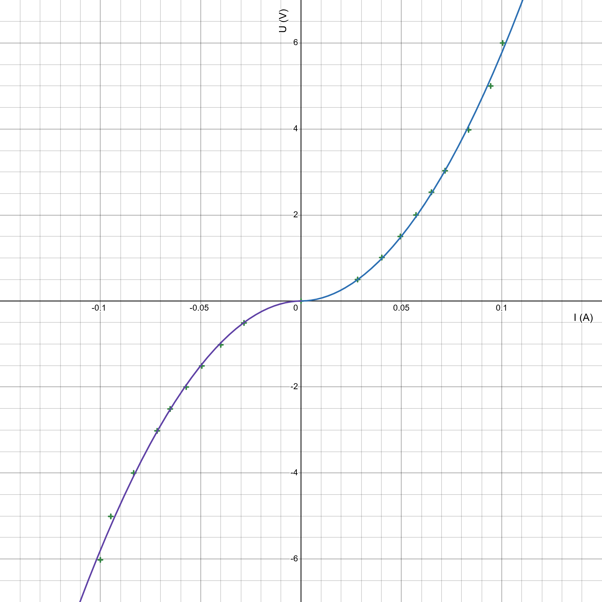
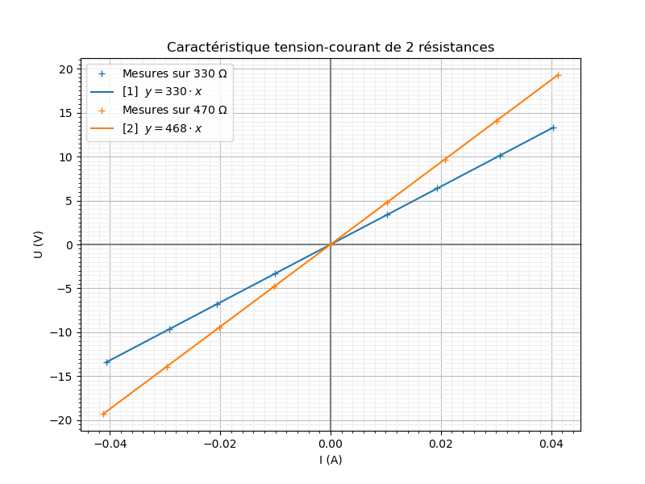
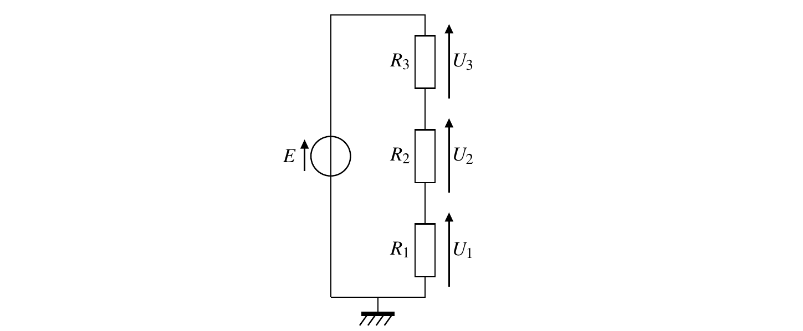
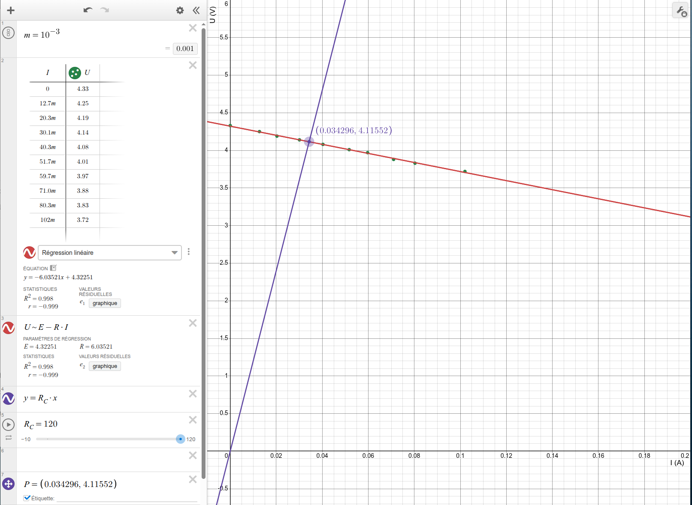

# Régime continu

!!! quote "Repère pour la formation – Partie physique - Option B"

    - Connaître et savoir utiliser les lois fondamentales de l’électricité (loi des nœuds, loi des mailles, loi d’Ohm).
    - Connaître et savoir utiliser la relation du pont diviseur de tension.
    - Savoir calculer la résistance équivalente de deux ou plusieurs résistances en série et en parallèle.
    - Savoir calculer la puissance, l’énergie fournie par un générateur ou consommée par un récepteur.
    - Savoir calculer l’autonomie d’une batterie à partir de sa capacité.

## Cours

[Courants et tensions électriques - Cours :fontawesome-solid-file-pdf:](../../assets/cours/regime-continu/bts-ciel_courant-tension-electriques_cours.pdf)

[Dipôles en régime continu - Cours :fontawesome-solid-file-pdf:](../../assets/cours/regime-continu/bts-ciel_dipoles-regime-continu_cours.pdf)

## Exercices

[Courants et tensions électriques - Exercices :fontawesome-solid-file-pdf:](../../assets/cours/regime-continu/bts-ciel_courant-tension-electriques_exercices.pdf)

[Dipôles en régime continu - Exercices :fontawesome-solid-file-pdf:](../../assets/cours/regime-continu/bts-ciel_dipoles-regime-continu_exercices.pdf)

## TP - Etude d’une lampe

??? abstract "Résumé"
    
    - Étude d'un dipôle passif non-linéaire ;
    - Caractéristique tension-courant et modélisation ;
    - Puissance électrique reçue.

Énoncé : [TP1 - Etude d'une lampe :fontawesome-solid-file-pdf:](../../assets/cours/regime-continu/bts-ciel_dipoles-regime-continu_TP1.pdf)

Éléments de correction : [Feuille calcul Desmos :fontawesome-solid-file-pdf:](../../assets/cours/regime-continu/tp_lampe_desmos.pdf)

{width="400"}
/// caption
///

## TP - Loi d'Ohm

??? abstract "Résumé"

    - Caractéristique tension-courant d'une résistance ;
    - Détermination de la loi d'Ohm ;
    - Influence de la valeur de la résistance sur l'intensité du courant.

Enoncé : [TP2 - Résistance électrique :fontawesome-solid-file-pdf:](../../assets/cours/regime-continu/bts-ciel_dipoles-regime-continu_TP2.pdf)

{width="500"}
/// caption
///

## TP - Association de résistances

??? abstract "Résumé"

    - Association de 3 résistances ;
    - Résistance équivalente ;
    - Diviseur de tension ;

Énoncé : [TP3 - Association de résistances :fontawesome-solid-file-pdf:](../../assets/cours/regime-continu/bts-ciel_dipoles-regime-continu_TP3.pdf)

{width="500"}
/// caption
///

{width="550"}
/// caption
///

## TP - Étude d’une pile (MET)

??? abstract "Résumé"

    - Caractéristique tension-courant d'une pile ;
    - Modélisation ;
    - Détermination de la tension à vide et de la résistance interne ;
    - Point de fonctionnement en charge.

Énoncé : [TP4 - Étude d’une pile :fontawesome-solid-file-pdf:](../../assets/cours/regime-continu/bts-ciel_dipoles-regime-continu_TP4.pdf)

{loading=lazy}
/// caption
///